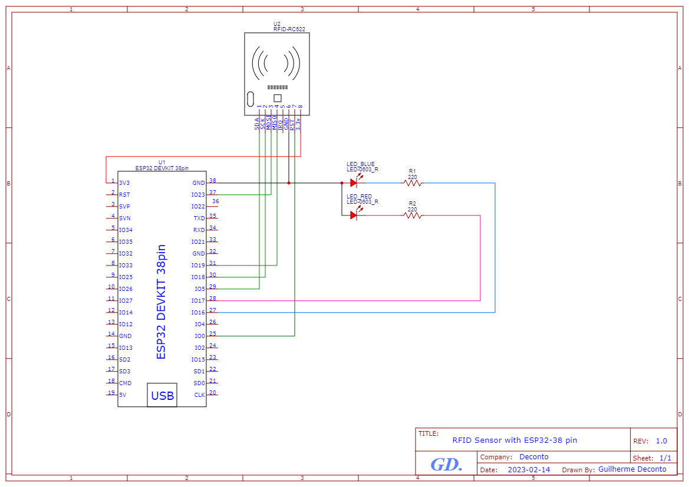

# ESP32-RFID

## Description

This project aims to create a simple RFID reader using an ESP32 and a MFRC522 RFID reader. The RFID reader will be able to read the UID of a card and send it to a NestJS server. The backend server will then be able to allow a certain user to do something.

For this system to work there are a few important components:
- Tags or ID Cards: All users have an ID card or Tag which is identified using UID. The UID is a 4 byte number which is unique to each card. The UID is read by the RFID reader and sent to the server.
- ESP32: The ESP32 is a microcontroller which is able to read the UID of the card and send it to the server.
- Backend: The backend is a NestJS server which is able to receive the UID and check if the user is allowed to do something. This backend is connected to a relational database PostgreSQL using TypeORM as ORM.

### Deploy

During the process of creating a software application, it's common to write code within a development environment. However, at some point, it becomes necessary to launch the application in a production environment while still carrying out the development process within the development environment. For this reason, it's important to be able to manage environment variables in a way that allows us to easily switch between environments. In this project, we use the the NestJS-Config module.

Afterwards, we will use Docker's containers to deploy our code by producing an image using docker-compose and our code.

### Circuit Schematic

Bellow you can find the schematic of the circuit.



## Essentials

1. Create a file called WiFiCredentials.h in the root folder and add your wifi credentials like so:

```c++
#define SSID "SSID"
#define PASSWORD "PASSWORD"
```

2. Create a file called `dev.env` and `prod.env` in the backend folder and add your environment variables like so:

```env
PORT=3000
DB_HOST=db
DB_PORT=5432
DB_USERNAME=postgres
DB_PASSWORD=postgres
DB_DATABASE=postgres
```